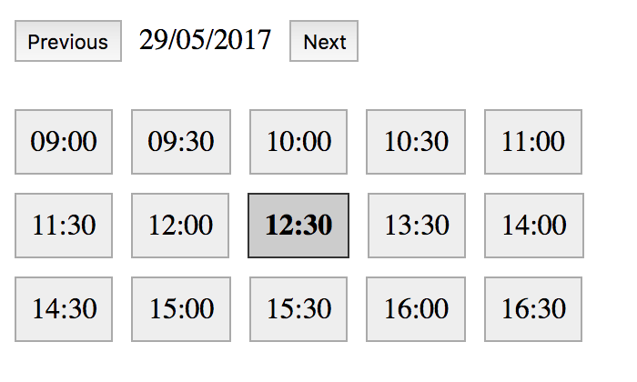

# appointment-selector

> Easily select appointments with tons of customization for the shop.



## Getting Started

Download the [development version][max].

[max]: https://raw.githubusercontent.com/mashhoodr/jquery-appointment-selector/master/dist/jquery.appointment-selector.js

In your web page:

```html
<script src="jquery.js"></script>
<script src="moment.js"></script>
<script src="dist/appointment-selector.min.js"></script>
<div id="appointment"></div>
<script>
  jQuery(function ($) {
    $('#appointment').appointmentSelector({});
  });
</script>
```

Check out demo in the demo folder.

### API

The API is focused around customizability of the store and bookings:

*times*

Takes an array of objects { start: 9, end: 17 } - which define the open and closing times for the shop (and the selection). These are currently limited to hours in 24 hour format. Array should have 7 objects starting from Sunday (0 index)

*holidays*

Takes an array of strings formatted DD/MM/YYYY, which are days shop will be closed and those days get skipped.

*bookings*

Takes a string array, format is YYYY-MM-DDTHH:mm:ss.SSSZ - these are the bookings already done in the shop and those slot should not show. These currently check by the hour as well.

*select - function(datTime) {}*

Takes a function which is triggered with the `selectedDateTime` when the box is clicked. You can also pick the selected DOM node using `$('.as-time.active')`.


## License

MIT © Mashhood Rastgar
